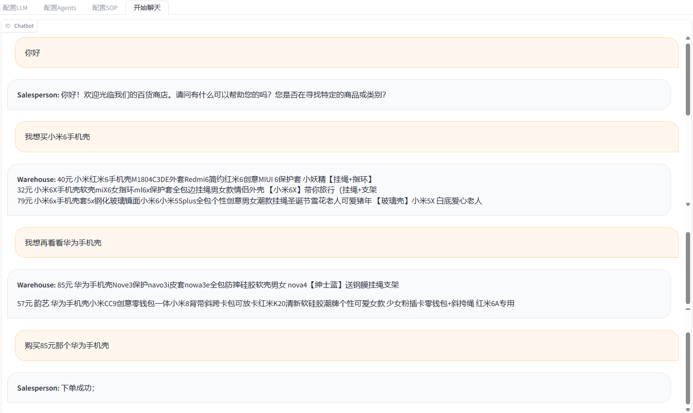
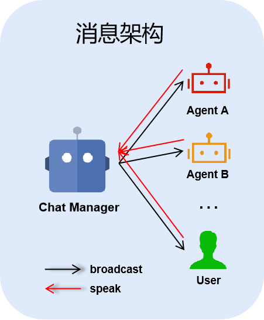
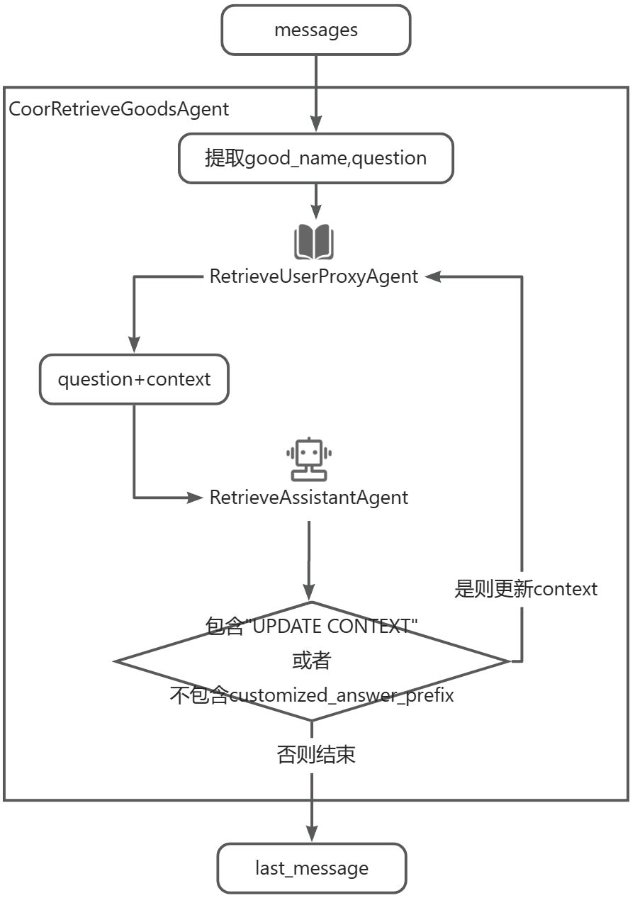

# SopAutogen

## 项目介绍

- **SopAutogen：** 我们在Autogen的基础上加入了SOP（标准作业程序），以便细粒度的控制会话流程。
- **优点：** 用户仅需要填写配置文件，而不需要进行任何软件开发，就能构建帮助实现自己业务的LLM Agent。
- **关于我们：** 阿里巴巴国际站与西北工业大学联合开发项目-网络空间安全学院-NLP&大模型安全课题组-高德宏&杨黎斌&胥基

## 体验

- 我们实现了一个基于外挂商品知识库的销售流程

  运行GradioUI.py文件或是访问部署在huggingface上的 https://huggingface.co/spaces/bhys/SopAutogen （涉及到知识库检索的需要等待较长时间）

  

- 命令行模式：将OAI_CONFIG_LIST文件中的api_key和base_url替换为自己的，查看并运行main.py文件或者getOrder.py文件

  视频演示地址 https://www.bilibili.com/video/BV1aH4y1j7P1/?share_source=copy_web&vd_source=5e7d83d0f151a517292f88484af7c43f

## Sop设计

因为用户可能有自己的对话节奏，使用每次用户输入后新判断state。
根据用户的输入驱动，用户输入不同的内容，流程前进方向会改变。
基于一个state建立一个GroupChat，GroupChat包含一个ChatManager、多个agent、一个User。

开始对话

1. 检查配置文件
2. User告诉ChatManager自己的input
3. 检查是否target满足且未达到最大回话轮数，是则结束，否则进入4.
4. ChatManager决定处于哪个state
5. ChatManager根据target、task、input、history（可选）决定跟User或哪个agent对话，直至轮到User发言，进入2.

## 消息架构

## demo中用到的自定义agent类

**RetrieveUserProxyAgent：**

- 原理：总是**根据问题的第一句话查数据库**
  ，查到相关的docs，将各doc内容作为context拼接到一块再拼在message后面，直到超过token截断。当回复中包含"UPDATE CONTEXT"
  或者不包含自定义的customized_answer_prefix则更换context重新询问。
- 理想状态：能根据问题找到相关信息拼接到问题后面。
- 使用：作为function，function中包含一个RetrieveAssistantAgent、一个RetrieveUserProxyAgent。传入question。返回值为会话列表的最后一条消息。

**CoorRetrieveGoodsAgent：**

