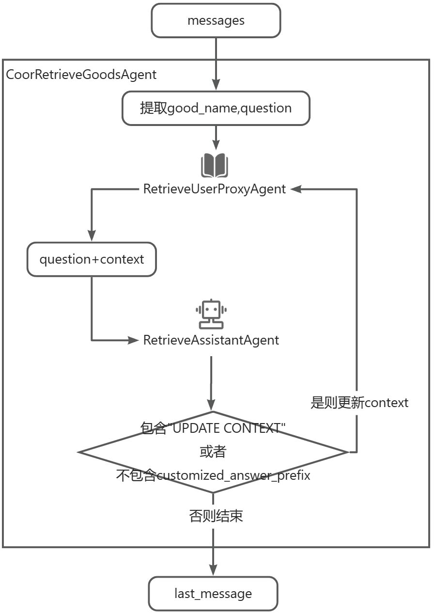

# Sop设计

 因为用户可能有自己的对话节奏，这种任务完成再跳出state循环的做法无法适应用户节奏。改用每次用户输入后新判断state。
 根据用户的输入驱动，用户输入不同的内容，流程前进方向会改变。
 基于一个state任务task建立一个GroupChat，GroupChat包含一个ChatManager、多个agent、一个User。
- ChatManager：决定跟哪个agent对话（用户根据预设模式介入）
- agent：只根据ChatManager的提问回答
- User：模式介入

 开始对话
 1. ChatManager获取除User外所有agent能力
 2. ChatManager向用户介绍自己融合其他agents后的能力，询问需求
 3. User告诉ChatManager自己的input
 4. 检查是否target拥有且满足，是则结束，否则进入5.
 5. ChatManager决定处于哪个state
 6. ChatManager根据target、task、input、history（可选）决定跟User或哪个agent对话，直至轮到User发言，进入3.

# 体验

运行 getOrder.py文件

# 用到的agent类

**TeachableAgent：**

- 原理：db中存储问题和答案序列，文件中存储答案序列和答案内容。要永久化存储需要手动调用learn_from_user_feedback()，否则记忆只存储在对话列表中。
- 理想状态：调用learn_from_user_feedback()后能够自动化的记住有用的。

**RetrieveUserProxyAgent：**

- 原理：总是**根据问题的第一句话查数据库**，查到相关的docs，将各doc内容作为context拼接到一块再拼在message后面，直到超过token截断。当回复中包含"UPDATE CONTEXT"或者不包含自定义的customized_answer_prefix则更换context重新询问。
- 理想状态：能根据问题找到相关信息拼接到问题后面。
- 使用：作为function，function中包含一个RetrieveAssistantAgent、一个RetrieveUserProxyAgent。传入question。返回值为会话列表的最后一条消息。

**CoorRetrieveGoodsAgent：**

